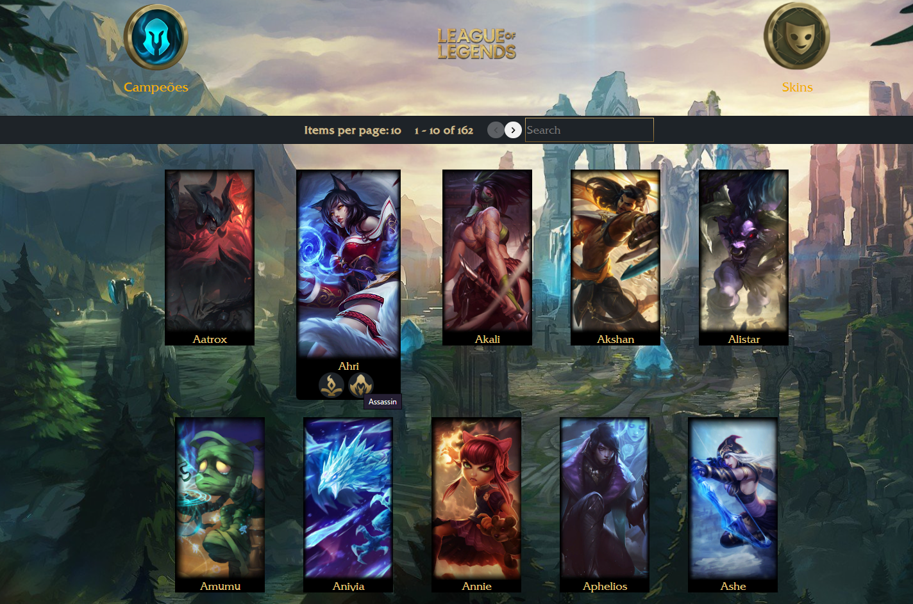

# Projeto Liga das Lendas

<!--ts-->

### Tópicos

- [Descrição do projeto](#descrição)
- [API Utilizada](#api)
- [Funcionalidades](#funcionalidades)
- [Ideia para o projeto](#inspiracao)
- [Telas](#telas)
- [Tecnologias](#tecnologias)
    - [Jest](#jest)
 - [Princípios da Engenharia de Software](#principios)
 - [Desafios encontrados e como foi solucionados](#desafios)
 - [Melhorias a serem feitas e seu impacto](#melhorias)
 - [Sobre](#about)
 - [Contato](#contato)
 
 <!--te-->
 
<h1 id="descrição">Descrição do projeto</h1>
Este projeto consiste em mostrar todos os campeões do jogo League of Legends, assim como suas habilidades, sua história e todas as suas skins.

<h1 id="api">API utilizada</h1>
Neste projeto eu utilizei a API da [Riot Games](https://developer.riotgames.com/) para ter acesso aos campeões e seus detalhes.
[I'm an inline-style link](https://www.google.com)

<h1 id="funcionalidades">Funcionalidades</h1>
Nesta pagina podemos visualizar os campeões e suas especialidades

