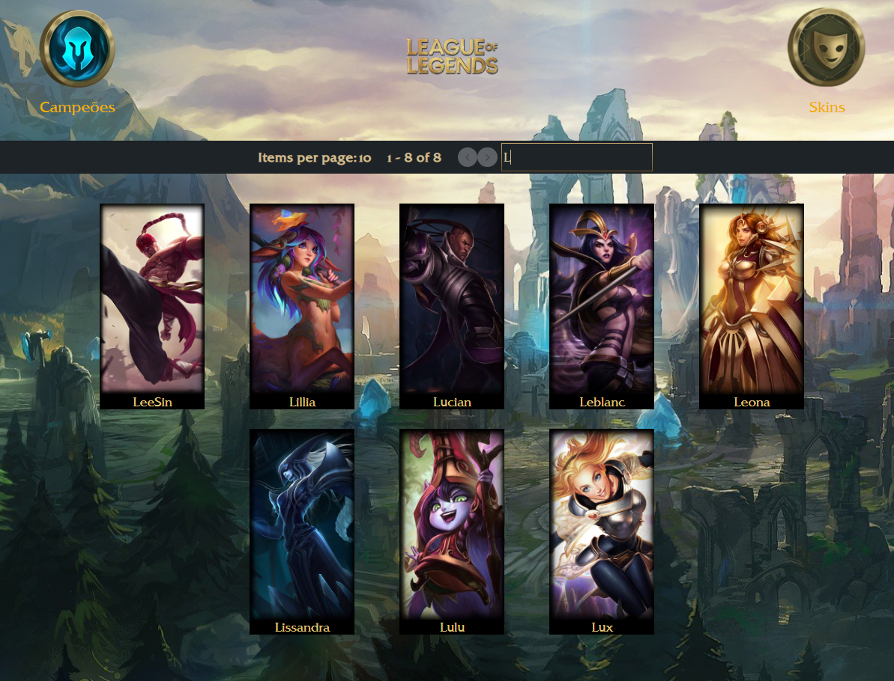

# Projeto Liga das Lendas

<!--ts-->

### Tópicos

- [Descrição do projeto](#descrição)
- [API Utilizada](#api)
- [Funcionalidades](#funcionalidades)
   - [Visualizar campeões](#visualizar)
   - [Buscar campeões](#busca)
   - [Visualizar detalhes do campeão](#detalhes)
- [Ideia para o projeto](#inspiracao)
- [Telas](#telas)
- [Tecnologias](#tecnologias)
   - [Jest](#jest)
 - [Princípios da Engenharia de Software](#principios)
 - [Desafios encontrados e como foi solucionados](#desafios)
 - [Melhorias a serem feitas e seu impacto](#melhorias)
 - [Sobre](#about)
 - [Contato](#contato)
 
 <!--te-->
 
<h1 id="descrição">Descrição do projeto</h1>
Este projeto consiste em mostrar todos os campeões do jogo League of Legends, assim como suas habilidades, sua história e todas as suas skins.

<h1 id="api">API utilizada</h1>
Neste projeto eu utilizei a API da <a href="https://developer.riotgames.com">Riot Games</a> para ter acesso aos campeões e seus detalhes.

<h1 id="funcionalidades">Funcionalidades</h1>
<h2 id="visualizar">Visualizar campeões</h2>
Nesta pagina podemos visualizar os campeões e suas especialidades

<h2 id="busca">Buscar campeões</h2>
Nete campo podemos buscar o campeão pelo nome e mostrar

<h2 id="busca">Visualizar detalhes do campeão</h2>
Após clicar no campeão desejado podemos visualizar sua passiva, todas suas habilidades e sua história.
