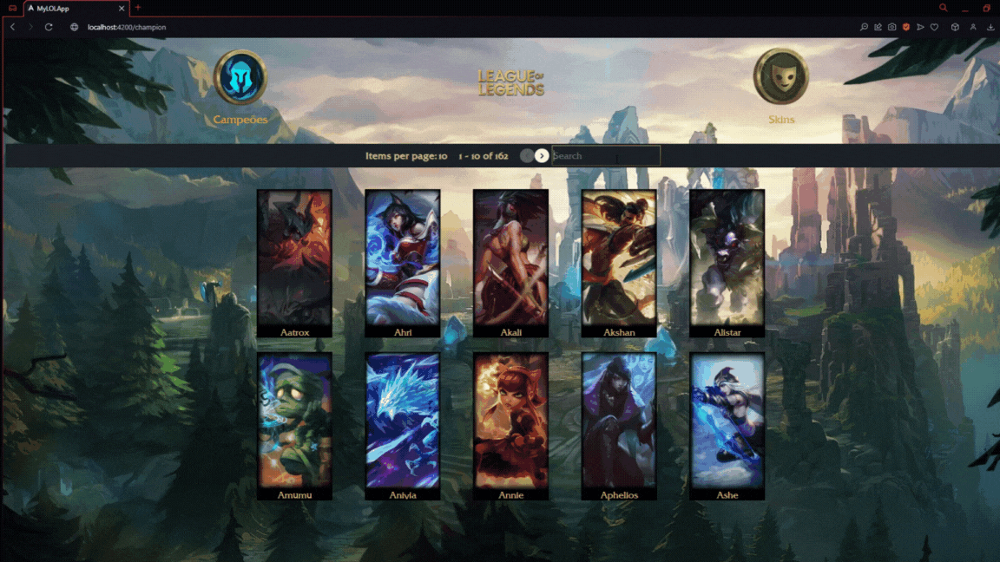

# Projeto Liga das Lendas

   
   
   
   
   
   
   

<!--ts-->

### Tópicos

- [Descrição do projeto](#descrição)
- [API Utilizada](#api)
- [Funcionalidades](#funcionalidades)
   - [Visualizar campeões](#visualizar)
   - [Buscar campeões](#busca)
   - [Visualizar detalhes do campeão](#detalhes)
   - [Visualizar skins](#skins)
- [Tecnologias](#tecnologias)
   - [Front-end](#front)
   - [Back-end](#back)
   - [Banco de dados](#banco)
 - [Princípios da Engenharia de Software](#principios)
 - [Desafios encontrados](#desafios)
 - [Melhorias a serem feitas](#melhorias)
 - [Sobre](#sobre)
 - [Contato](#contato)
 
 <!--te-->
 
<h1 id="descrição">Descrição do projeto</h1>
Este projeto consiste em mostrar todos os campeões do jogo League of Legends, assim como suas habilidades, sua história e todas as suas skins.

<h1 id="api">API utilizada</h1>
Neste projeto eu utilizei a API da <a href="https://developer.riotgames.com">Riot Games</a> para ter acesso aos campeões e seus detalhes.

<h1 id="funcionalidades">Funcionalidades</h1>
<h2 id="visualizar">Visualizar campeões</h2>
Nesta pagina podemos visualizar os campeões e suas especialidades com paginação de 10 campeões por página.

<h2 id="busca">Buscar campeões</h2>
Nete campo podemos buscar o campeão pelo nome e mostrar.

<h2 id="detalhes">Visualizar detalhes do campeão</h2>
Após clicar no campeão desejado podemos visualizar sua passiva, todas suas habilidades e sua história.

<h2 id="skins">Visualizar skins</h2>
Após clicar no icone de skins somos direcionados para uma pagina que contem todas as skins de todos os campeões, a paginação faz com que a cada página tenhamos todas as skins de apenas um campeão, e nela tambem podemos buscar algum campeão específico.

<h1 id="tecnologias">Tecnologias</h1>
 <h2 id="front">Front end</h2>
 <ul>
 <li>Angular</li>
 <li>TypeScript</li>
 <li>CSS</li>
 </ul>
 <h2 id="back">Back end</h2>
 <ul>
 <li>NodeJS</li>
 <li>Jest</li>
 </ul>
 <h2 id="banco">Banco de dados</h2>
 <ul>
 <li>Postgres</li>
 <li>Railway</li>
 </ul>

<h1 id="principios">Princípios da engenharia de Software</h1>
 
[S]ingle Responsibility Principle: Princípio da responsabilidade única. Com a componentização do Angular busquei dar uma responsabilidade para cada componente.

<h1 id="desafios">Desafios encontrados</h1>

Primeiramente eu fiz o projeto apenas com front-end, fazendo as requisições com axios, mas isso me gerou problemas pelo caminho e um código muito grande, então decidi criar um back-end para tratar os dados e armazená-los no banco de dados, assim eu saberia exatamente o que recebo em cada requisição.
Outro desafio foi que a url onde pego as informações dos campeões continha o nome do campeão, então para conseguir armazenar essas informações de cada campeão criei um loop para buscar o nome do campeão e depois fazer a requisição com esse nome.

<h1 id="melhorias">Melhorias a serem feitas</h1>

Eu implementei testes no back end utilizando JEST, mas foi minha primeira vez fazendo testes, estou aprofundando meus estudos em testes para conseguir ter uma cobertura de 100% em testes.
Também estou aprofundando meus conhecimentos em Angular pois sei que esse framework tem muitas possibilidades que ainda são desconhecidas pra mim.

Minha idéia é expandir esse projeto para englobar outros coisas do jogo como itens, feitiços,runas e também implementar uma versão mobile para facilitar a pequisa

<h1 id="sobre">Sobre mim</h1>

Meu nome é Pedro Henrique, tenho 25 anos, estou atualmente cursando o segundo semestre em Análise e desenvolvimento de sistemas na FATEC de São José do Rio Preto
